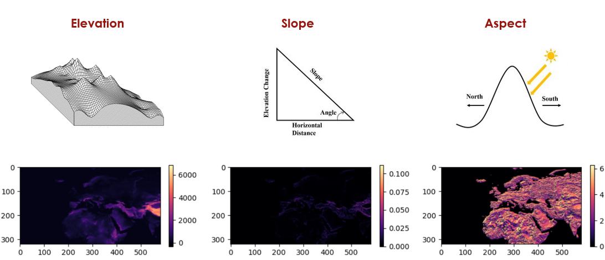
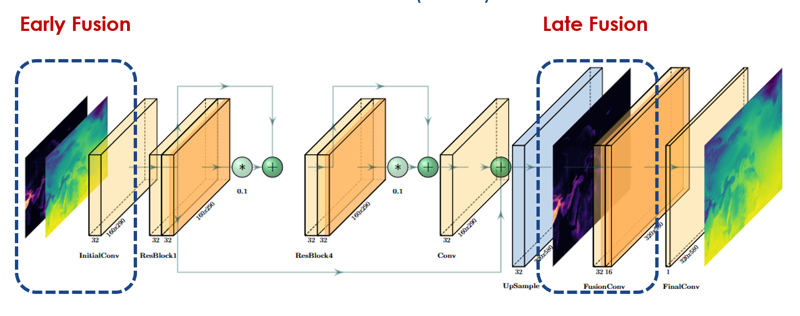
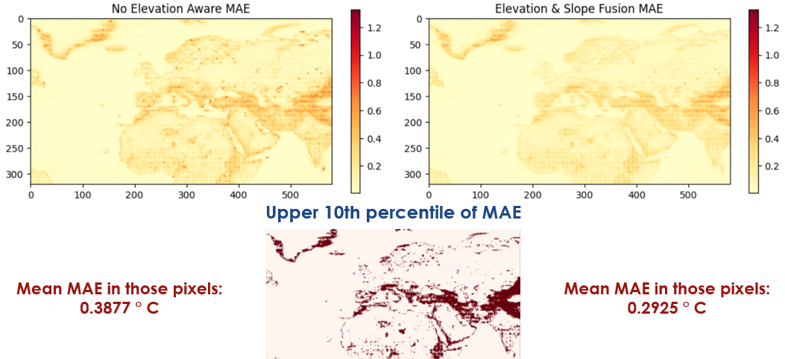

# Terrain-Aware-DL-Downscaling

    <b>Elevation Data Integration Approaches for Deep Learning-Based   2-m Temperature Downscaling</b>  
    Project for AI-driven Data Engineering and Reusability for Earth and Space Sciences   <a href="https://dares25.github.io/">(DARES 2025) Workshop</a> 
    <b>October 2025</b> 
    <a href="https://ceur-ws.org/Vol-4128/">Volume 4128 of the CEUR Workshop Proceedings</a>

Global Climate Models (GCMs) provide valuable climate projections, but operate at coarse spatial resolutions, limiting their usefulness for local-scale applications. Downscaling techniques are therefore essential to bridge this gap. This study investigates how the integration of elevation data can improve the performance of CNN-based architecture deep learning models to downscale the near-surface air temperature (T2m) from a 0.5°×0.5° grid to a 0.25°×0.25° resolution. Different elevation data integration strategies are evaluated to demonstrate their impact on downscaling effectiveness, highlighting the role of terrain-related features in refining temperature estimates.

## 📁 Dataset

The training input consists of ERA5 reanalysis data <a href="#footnote1">1</a> paired with altitude information from the U.S. Geological Survey 3D Elevation Program DEM <a href="#footnote2">2</a>.

- <b>Variable</b>: 2-meter air temperature (T2m)
- <b>Period</b>: 2000 – 2020
- <b>Temporal resolution</b>: 6-hourly (00:00, 06:00, 12:00, 18:00 UTC)
- <b>Spatial domain</b>: Latitude 80° N to 0°, Longitude 60° W to 85° E

## ⚙️ Preprocessing

To create a controlled downscaling problem, the native 0.25-degree data were upscaled to 0.5 degrees, and the model was then tasked with reconstructing the original high resolution. This approach is model-agnostic, as it does not rely on a specific low-resolution forecast model as input. Instead, high-resolution reanalysis data are artificially degraded to generate the low-resolution input, thereby avoiding the biases of any particular model.
 

So, the preprocessing included the following steps:

1. <b>Upscaling</b>: Bicubic interpolation to match target resolution (from 0.25 ° x 0.25 ° to 0.5 ° x 0.5 °)
2. <b>Normalization</b>: Z-score standardization
3. <b>Shuffling</b>: Randomize data order to remove temporal bias
4. <b>Splitting</b>: 70% training, 15% validation, 15% testing

## 🧩 Elevation-derived Features

Beyond raw elevation, the potential added value of derived topographic features was investigated. Slope and Aspect maps were generated from the base elevation data to support this analysis.

## 🤖 DL Model Architecture

The downscaling task was approached as a <b>Single Image Super-Resolution</b> problem, utilizing an <b>Enhanced Deep Super-Resolution (EDSR)</b> network.

Two main elevation integration strategies were tested:

- <b>Early Fusion</b>: elevation data is concatenated with the low-resolution temperature input at the initial stage

- <b>Late Fusion</b>: elevation data is introduced later in the network, closer to the output layer

In addition, a combination of these two approaches was also explored.

## 🧪 Results

To summarize the results visually, these maps display the MAE across the entire domain for both the non–elevation-aware model and the best elevation- and slope-aware model. Errors are notably higher in regions with complex terrain, such as mountainous and coastal areas. To quantify the impact of geospatial data integration on model performance in challenging regions, the MAE was calculated for the upper 10th percentile of pixels with the largest errors.

---

  1
  <a href="https://doi.org/10.24381/cds.adbb2d47" target="_blank">ERA5 hourly data on single levels from 1940 to present</a>

  2
  <a href="https://www.usgs.gov/core-science-systems/ngp/3dep" target="_blank">U.S. Geological Survey, The 3d elevation program (3dep)</a>

